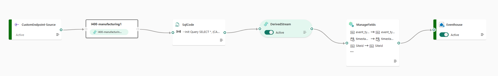
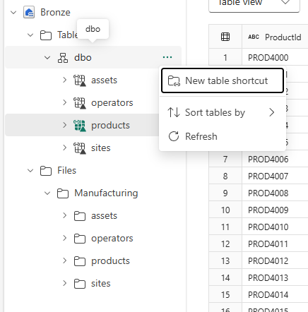
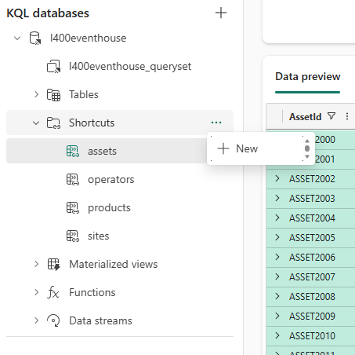
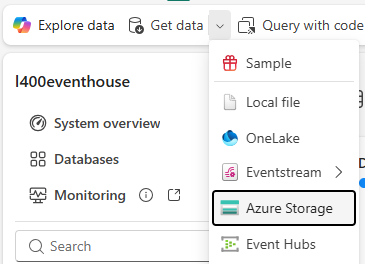
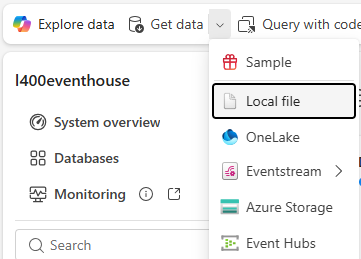
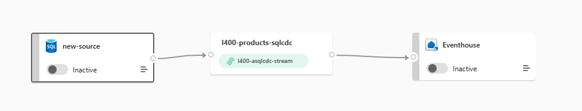

# Gather data

## Backstory
Currently Fabrikam’s data estate and pipelines are heavily fragmented. Hack your way to bring data from disparate sources and unify them in RTI. Using various connectors available in Eventstream, you can get data from streaming sources, and CDC from databases. Rich transformations are possible within Eventstream to cleanse and transform the data. Schema registry allows you to setup a robust and resilient streaming pipeline that can respond to changing schemas.

## Setup
For running this Act, 
1. You will need three Eventstreams, one Eventhouse, one Lakehouse, and one Azure storage account.
2. Required Notebooks and CSV file are found in the Data Simulators folder in this repo.
3. Use the "Shipping Simulator" notebook to generate shipping data. The notebook will generate data and push it to an Azure blob storage that you can configure. 
4. Use the "Manufacturing Simulator" notebook to generate manufacturing/production data. The notebook will generate data and push it to an Eventstream that you can configure while static Assets, Operators, and Sites data will be generated in the default Lakehouse connected to the Notebook.


## Challenges 

## 1. Ingest/Enrich Manufacturing data

Add AnomalyFlag column where defect probability is above 0.1 and change column datatypes where needed/appropriate.

Keep all fields excepts the last 3: EventProcessedUtcTime, PartitionId, EventEnqueuedUtcTime.

<details>
<summary>Hint!</summary>

Use SQL transformation on DefectProbability  column in stream – DefectProbability>0.1 = Anomaly

SQL Operator by default works only if there are no other operators in this stream. Can a DerivedStream help?

Be patient and let the data come into the Derived Stream

<details>
<summary>Guide</summary>

The following image shows an eventstream that ingests data using the appropriate setup based on known requirements/limitations.

The SQLCode block uses a case select to add the Anomaly column.

Example:
```
SELECT <columns>, (CASE WHEN <Rule> THEN <a> ELSE <b> END) as <column name> INTO [<Target name>] FROM [<source name>]
```

The ManageFields block selects which columns to keep and change datatype if needed.


</details>
</details>

## 2. Ingest a Manufacturing data
Assets, Operators, and sites are static data you need refer from Lakehouse without copying data.

Production data that is streaming from Eventstream.

<details>
<summary>Hint!</summary>

Use accelerated shortcuts for static data
<details>
<summary>Guide</summary>
This is a two-part process since Accelerated shortcuts only work on tables in a lakehouse.

Separate files with different schemas into subfolders.

Follow the build-in wizards to create table shortcuts in the lakehouse from the csv files then create accelerated shortcuts in the eventhouse.

Lakehouse shortcut:



Accelerated Evethouse shortcut:


</details>
</details>

## 3. Ingest Shipping data
Shipping events are pushed to an Azure blob storage in real-time.

Shipping provider details from GitHub Data Simulators/CSV.

<details>
<summary>Hint!</summary>

Use Continuous ingestion from Azure Storage

Use Local file ingestion method for Shipping provider details

<details>
<summary>Guide</summary>

From the Eventhouse Database select azure storage from Get data and follow the wizard:



From the Eventhouse Database select local file from Get Data and follow the wizard:


</details>
</details>

## 4. Ingest Products data (Optional since products data is available from manufacturing)
This static data is present in a SQL database
<details>
<summary>Hint!</summary>
Use Azure SQL CDC connector

<details>
<summary>Guide</summary>

Create a eventstream with a single source/sink and no processing:


</details>
</details>

## 5. Make weather data available to all Fabrikam distributors and setup hourly alerts for US region
<details>
<summary>Hint!</summary>
Create derived stream, Activator alerts on temperature
</details>
